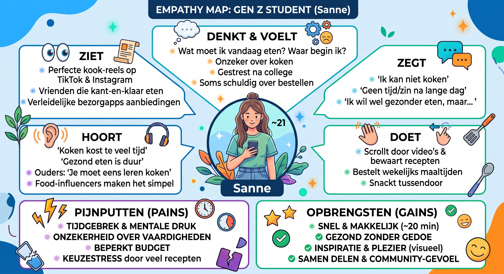

# Fase 1: Empathize (Begrijp de gebruiker)

In deze fase doen we onderzoek naar het verschijnsel **'ontkoking'** en de doelgroep **Generatie Z**. We willen begrijpen *wie* onze gebruiker is, *wat* hen tegenhoudt om te koken en *wat* hen juist zou motiveren. Pas als we dat snappen, kunnen we een platform bouwen dat écht aansluit.

## 1. Doelgroeponderzoek

### Wie is onze gebruiker?
Generatie Z (geboren tussen ~1997 en 2012), met focus op jongeren van **16–27 jaar** die op kamers wonen of net op zichzelf zijn. De primaire doelgroep is de *student/jongvolwassene* met weinig tijd, een beperkt budget en een druk sociaal leven. De tweede, kleinere doelgroep is de **beheerder (admin)** die content en gebruikers moet kunnen beheren.

### Persona: "Sanne, 21 jaar"
| Kenmerk | Beschrijving |
| :--- | :--- |
| Leeftijd | 21 jaar |
| Situatie | Student (hbo), woont op kamers in de stad, bijbaan naast de studie |
| Dagritme | College, werken, sporten, 's avonds series kijken / op socials |
| Budget | Beperkt (studiefinanciering + bijbaan) |
| Kookskills | Basis: pasta, eieren, simpele wokschotel |
| Mediagedrag | Volgt kook-reels op TikTok en Instagram, bewaart recepten maar maakt ze zelden |

### Pains (pijnpunten)
* **Tijdgebrek & mentale druk** – na een lange dag is er geen energie om te koken. Uit onderzoek (KRO-NCRV / FSIN) blijkt dat de **helft van de Nederlanders** minstens 1× per week geen zin heeft om te koken (gestegen van 35% naar 50%).
* **Gebrek aan kookvaardigheden/vertrouwen** – "Waar begin ik? Hoeveel ingrediënten heb ik nodig?" Onbekend maakt onbemind.
* **Geld** – online bezorging en kant-en-klaar zijn duur, terwijl het budget juist krap is.
* **Keuzestress & gebrek aan inspiratie** – receptensites voelen als eindeloze, onoverzichtelijke lijsten.
* **Ongezond eetpatroon als gevolg** – kant-en-klaar en fastfood bevatten meer calorieën, suiker, zout en verzadigd vet.

### Gains (behoeftes)
* **Snel & makkelijk** – recepten die in ~20 minuten klaar zijn met weinig ingrediënten (HAK-onderzoek 2025: **71% wil dat een maaltijd goed vult**, de helft wil makkelijk mee te nemen voeding).
* **Gezond zonder gedoe** – **60% van Gen Z zou gezondere keuzes maken als dit makkelijker was**.
* **Inspiratie & plezier** – koken moet laagdrempelig en visueel aantrekkelijk zijn (filmpjes, mooie foto's).
* **Erbij horen / delen** – recepten en ervaringen delen met vrienden en de community (**53% vindt koken leuk, 71% wil beter leren koken**).
* **Overzicht** – snel vinden wat je zoekt via categorie en ingrediënt.

## 2. Empathy Map (Visueel)

**👀 Ziet**
* Op socials (TikTok/Instagram) perfecte, snelle recepten die niet aansluiten op zijn/haar budget of skills.
* Vrienden en huisgenoten die óók bestellen of kant-en-klaar eten.
* Bezorgapps met verleidelijke aanbiedingen en gemak.

**👂 Hoort**
* "Koken kost te veel tijd."
* "Gezond eten is duur."
* Van ouders/familie: "Je moet eens leren koken."
* Food-influencers die koken makkelijk en leuk laten lijken.

**🗣️ Zegt**
* "Ik kan niet koken."
* "Ik heb geen tijd/zin om te koken."
* "Ik wil best gezonder eten, maar…"

**🧠 Denkt & Voelt**
* *Denkt:* "Wat moet ik vandaag eten? Waar begin ik?"
* *Voelt:* onzeker, gestrest, soms schuldig over bestellen — maar ook nieuwsgierig en leergierig.
* *Verlangt naar:* overzicht, snel resultaat en bevestiging ("dit kan ik ook!").

**🤸 Doet**
* Scrollt door food-video's en bewaart recepten, maar kookt ze zelden.
* Bestelt wekelijks of koopt kant-en-klaarmaaltijden.
* Snackt tussendoor in plaats van vaste maaltijden te eten.

**Pains:** tijdgebrek · mentale druk · onzekerheid over skills · geld · keuzestress
**Gains:** snel klaar · gezond · betaalbaar · inspirerend · deelbaar

## 3. Conclusie

> **Kerninzicht:** Generatie Z wil **wél** gezond en lekker eten, maar **gemak en snelheid winnen** op het moment van de keuze. Er zit een gat tussen de *intentie* ("ik wil koken") en het *gedrag* ("ik bestel toch"). Onze oplossing moet dat gat dichten door koken **snel, overzichtelijk, visueel en leuk** te maken — niet door te moraliseren over gezondheid.

Dit inzicht nemen we mee naar de **Define-fase** om een scherpe probleemstelling en het Programma van Eisen op te stellen.
