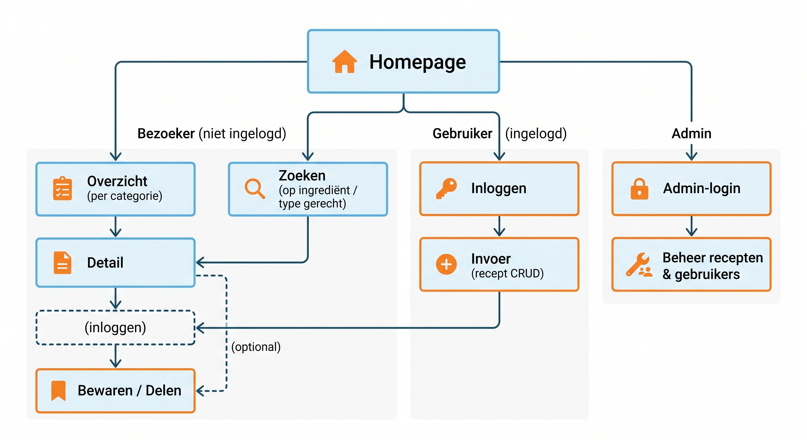

# Fase 3: Ideate (Oplossingen bedenken)

Vanuit het kernprobleem en de PvE bedenken we zo veel mogelijk oplossingsrichtingen (divergeren). Daarna kiezen we het concept dat het beste past (convergeren).

## 1. Concepten

**How-Might-We vraag:** *Hoe kunnen we Generatie Z op een laagdrempelige, snelle en visueel aantrekkelijke manier verleiden om zelf te koken en recepten te delen?*

We verkenden meerdere richtingen:

* **Concept 1 – "Swipe & Kook" (Tinder voor recepten):** recepten swipen op basis van wat je in huis hebt. Speels en herkenbaar, maar onoverzichtelijk voor zoeken op categorie.
* **Concept 2 – "Kook in 15" (tijd als filter):** alles draait om bereidingstijd en weinig ingrediënten. Snel en doelgericht, maar mist de community- en deelcomponent.
* **Concept 3 – "Smaakmaatje" (community-kookplatform):** een overzichtelijk receptenplatform met categorieën én zoekfunctie, aangevuld met gebruikersrecepten, delen op socials en een stap-voor-stap kookmodus. **← gekozen concept**

## 2. Conceptkeuze & Onderbouwing

We kiezen voor **Concept 3 (Smaakmaatje)** omdat dit concept het beste aansluit op het Programma van Eisen uit de Define-fase:

* Het dekt **alle Must Haves**: overzicht per categorie, detailpagina, invoerpagina (CRUD), zoekfunctie op ingrediënt én type gerecht, accounts en een admin-module.
* Het pakt het kerninzicht uit de Empathize-fase: **overzicht + snelheid + inspiratie**. Recepten zijn visueel en te filteren op tijd en moeilijkheid.
* De **community- en social-component** sluit aan bij het mediagedrag van Gen Z (53% vindt koken leuk, 71% wil beter leren koken; content wordt gedeeld via TikTok/Instagram).
* Concept 1 en 2 misten elk een kernonderdeel (overzicht resp. community) en zouden de PvE niet volledig halen.

## 3. User Flow (Visueel)



**Bezoeker (niet ingelogd):**
1. **Homepage** → kiest een categorie of gebruikt de zoekbalk.
2. **Overzichtspagina** → bekijkt alle gerechten binnen de gekozen categorie.
3. **Detailpagina** → bekijkt ingrediënten en bereidingswijze.
4. → *optioneel:* registreren/inloggen om een recept op te slaan of te delen.

**Gebruiker (ingelogd):**
1. **Inloggen / registreren** → dashboard.
2. **Invoerpagina** → een recept toevoegen, aanpassen of verwijderen.
3. **Detailpagina** → eigen of andermans recept delen/bewaren.

**Admin:**
1. **Inloggen** → admin-dashboard.
2. Beheer **recepten** (aanpassen/verwijderen) en **gebruikers** (rol wijzigen/verwijderen).

```
Homepage ──► Overzicht (per categorie) ──► Detail ──► (inloggen) ──► Bewaren / Delen
   │                                              ▲
   ├─► Zoeken (op ingrediënt / type gerecht) ─────┘
   │
   ├─► Inloggen ──► Invoer (recept CRUD) ──► Overzicht
   │
   └─► Admin-login ──► Beheer recepten & gebruikers
```
