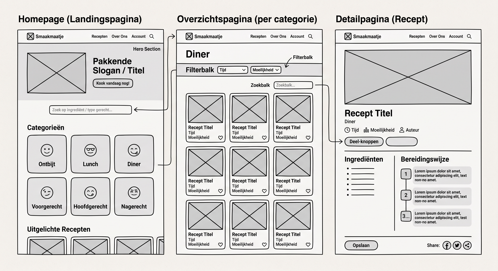
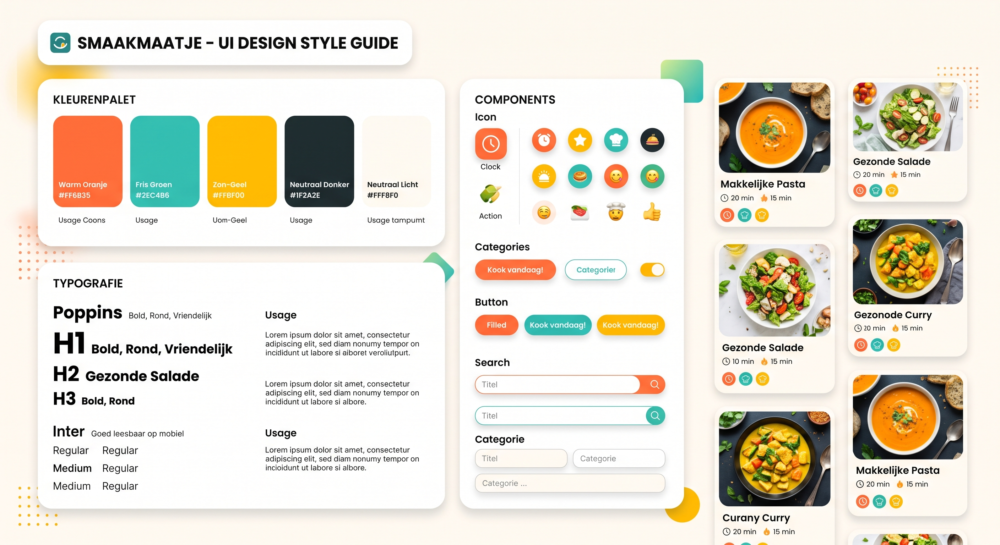
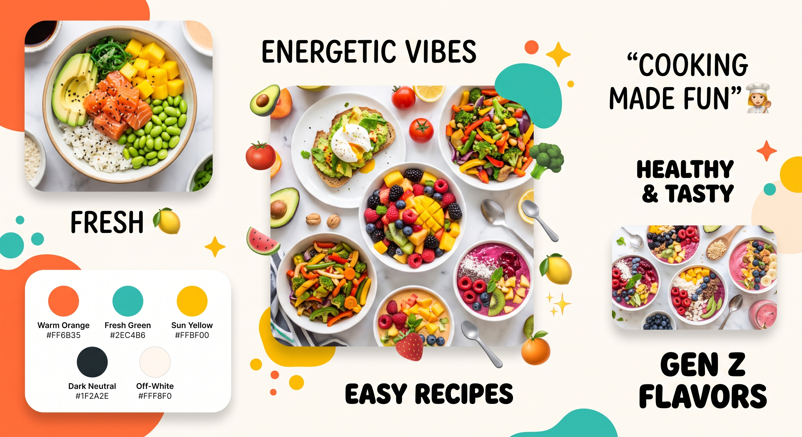
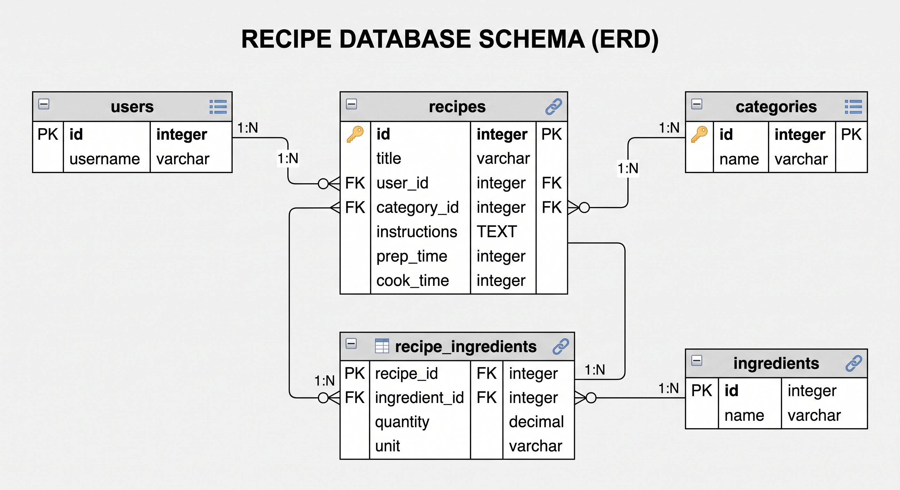

# Fase 4: Prototype (Ontwerp & Techniek)

We vertalen het gekozen concept (Smaakmaatje) naar een werkend prototype in Figma en werken de technische architectuur uit.

## 1. Wireframes (Lo-Fi)

**Homepage / landingspagina**
* Hero met pakkende slogan + CTA "Kook vandaag nog!"
* Zoekbalk (op ingrediënt / type gerecht)
* Categorie-tegels (ontbijt, lunch, diner, voorgerecht, hoofdgerecht, nagerecht)
* Uitgelichte / populaire recepten

**Overzichtspagina**
* Titel van de gekozen categorie + filterbalk (tijd, moeilijkheid)
* Grid van receptkaarten (foto, titel, tijd, ingrediënten)
* Zoekbalk

**Detailpagina**
* Grote gerechtfoto + kerninfo (tijd, moeilijkheid, categorie)
* Ingrediëntenlijst
* Stap-voor-stap bereiding
* Deel-knoppen (social) + opslaan

**Invoerpagina (recept CRUD)**
* Formulier: titel, categorie, tijd, moeilijkheid, foto, ingrediënten (herhaalvelden), stappen
* Knoppen: opslaan / aanpassen / verwijderen

**Registratie & inloggen**
* Eenvoudige formulieren (e-mail, gebruikersnaam, wachtwoord)

**Admin-module**
* Overzicht recepten (bewerken/verwijderen)
* Overzicht gebruikers (rol wijzigen/verwijderen)

## 2. Visual Design (Hi-Fi) — Style Guide

**Sfeer (Gen Z):** fris, energiek, laagdrempelig, veel witruimte, echte food-foto's.

**Kleurenpalet**
| Rol | Kleur | Hex |
| :--- | :--- | :--- |
| Primair | Warm oranje | `#FF6B35` |
| Secundair | Fris groen | `#2EC4B6` |
| Accent | Zon-geel | `#FFBF00` |
| Neutraal donker | Bijna-zwart | `#1F2A2E` |
| Neutraal licht | Off-white | `#FFF8F0` |

**Typografie**
* Koppen: **Poppins** (bold, rond, vriendelijk)
* Body: **Inter** (goed leesbaar op mobiel)

**Beeld & iconen**
* Echte, kleurrijke food-foto's (top-down).
* Rounded corners en zachte schaduwen.
* Iconen/emoji per categorie.

## 3. Technische Architectuur

* **Frontend:** HTML5, CSS3 (Flexbox/Grid), Vanilla JavaScript — mobile first.
* **Backend/Data:** PHP + MySQL (server-side, database-koppeling via PDO).
* **Hosting:** FTP-upload (eis uit de opdracht).
* **Versiebeheer:** Git / GitHub.

### ERD (Entity Relationship Diagram)

* `users` (1) ──< (n) `recipes` >── (1) `categories`
* `recipes` (n) >──< (n) `ingredients` (via koppeltabel `recipe_ingredients`)

### Datadictionary

**users**
| Kolom | Type | Beschrijving |
| :--- | :--- | :--- |
| id | INT (PK, AUTO_INCREMENT) | Uniek ID |
| username | VARCHAR(50) | Gebruikersnaam |
| email | VARCHAR(100) | E-mailadres |
| password_hash | VARCHAR(255) | Versleuteld wachtwoord |
| role | ENUM('user','admin') | Rol van de gebruiker |
| created_at | DATETIME | Aanmaakdatum |

**recipes**
| Kolom | Type | Beschrijving |
| :--- | :--- | :--- |
| id | INT (PK, AUTO_INCREMENT) | Uniek ID |
| user_id | INT (FK → users.id) | Auteur van het recept |
| category_id | INT (FK → categories.id) | Categorie |
| title | VARCHAR(100) | Naam van het gerecht |
| description | TEXT | Korte omschrijving |
| image_url | VARCHAR(255) | Pad naar de foto |
| prep_time | INT | Bereidingstijd in minuten |
| difficulty | ENUM('makkelijk','gemiddeld','moeilijk') | Moeilijkheidsgraad |
| created_at | DATETIME | Aanmaakdatum |

**categories**
| Kolom | Type | Beschrijving |
| :--- | :--- | :--- |
| id | INT (PK, AUTO_INCREMENT) | Uniek ID |
| name | VARCHAR(50) | Naam (ontbijt, lunch, …) |
| slug | VARCHAR(50) | URL-vriendelijke naam |

**ingredients**
| Kolom | Type | Beschrijving |
| :--- | :--- | :--- |
| id | INT (PK, AUTO_INCREMENT) | Uniek ID |
| name | VARCHAR(80) | Naam van het ingrediënt |

**recipe_ingredients** (koppeltabel)
| Kolom | Type | Beschrijving |
| :--- | :--- | :--- |
| recipe_id | INT (FK → recipes.id) | Recept |
| ingredient_id | INT (FK → ingredients.id) | Ingrediënt |
| amount | VARCHAR(50) | Hoeveelheid (bv. "200 g") |

### Zoekfunctie (technisch)
* Zoeken op **ingrediënt:** `SELECT … JOIN recipe_ingredients … WHERE ingredients.name LIKE :q`
* Zoeken/filteren op **type gerecht:** filter op `category_id`.
